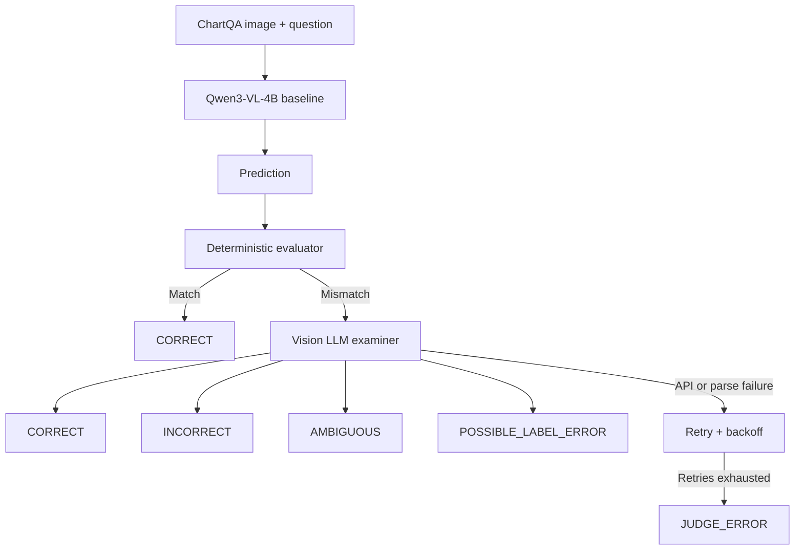

# FinChart-R1

FinChart-R1 is a multimodal chart-reasoning project. Its implemented scope is **Phase 1: a Qwen3-VL baseline and robust evaluation system**. It deliberately establishes a reproducible baseline before attempting fine-tuning.

> Phase 1 does not train a model. SFT, Vision GRPO, deployment, and full benchmark comparisons are planned work, not completed results.

## Motivation

Generative VLM evaluation cannot rely exclusively on exact string match: `25` and `25.0` are safely equivalent, while `0.72` and `72` require visual/contextual interpretation. FinChart-R1 uses a conservative deterministic evaluator first, then a vision LLM examiner only for mismatches.

## Phase 1 architecture



The model is `unsloth/Qwen3-VL-4B-Instruct-unsloth-bnb-4bit`; the dataset is `HuggingFaceM4/ChartQA`, evaluated on its validation split using greedy decoding.

## Hybrid evaluation

The deterministic layer normalizes capitalization, whitespace, punctuation, answer wrappers, slash spacing, and numeric forms such as `25`/`25.0`. It intentionally does **not** infer percentage equivalence. The vision examiner receives the chart, question, benchmark answer, and candidate answer, then returns a structured verdict and error category.

`AMBIGUOUS` means the examiner successfully inspected the chart but cannot decide confidently. API, network, or JSON failures are always `JUDGE_ERROR`; they are retried with exponential backoff and checkpointed for later resume.

## Phase 1 result snapshot

The following figures describe one **500-sample ChartQA validation subset**, not the official full-benchmark score.

| Metric | Phase 1 result |
| --- | ---: |
| Evaluated subset | 500 validation samples |
| Deterministic accuracy | 63.4% |
| Final correct / incorrect | 351 / 114 |
| Resolved accuracy | 75.48% |
| Resolved coverage | 93.0% |
| Possible label errors | 28 |
| Ambiguous / judge errors | 2 / 5 |
| Judge technical success | ~97.27% |

**Resolved accuracy** is `CORRECT / (CORRECT + INCORRECT)`. **Resolved coverage** is `(CORRECT + INCORRECT) / total`. The first must always be read together with the second.

Raw experiment files are intentionally not included: place your own CSV/JSON artifacts in [`results/`](results/README.md). The directory is configured to avoid accidentally committing raw outputs or API metadata.

## Error analysis

Among the 114 examiner-confirmed incorrect predictions, the main observed categories were:

| Error type | Count | Share |
| --- | ---: | ---: |
| Numerical reasoning | 54 | 47.4% |
| Visual extraction | 34 | 29.8% |
| Counting | 21 | 18.4% |
| Logical reasoning | 5 | 4.4% |

Numerical reasoning includes arithmetic, ratios, averages, differences, and unit/scale handling. Visual extraction reflects inconsistent grounding on dense or multi-series charts—not an inability to recognize images. Counting failures concern global visual enumeration; logical failures include comparisons and conditions.

The same subset included 28 `POSSIBLE_LABEL_ERROR` cases (about 5.6%). This is an LLM-judged observation, not a claim that ChartQA as a whole is unreliable. It does mean raw benchmark labels should not automatically become clean SFT targets.

## Quick start

```bash
git clone <your-repository-url>
cd FinChart-R1
python -m venv .venv
# Windows: .venv\Scripts\activate
pip install -r requirements.txt
pytest
python scripts/run_baseline.py
```

For the vision examiner, copy `.env.example` to `.env` (or set the same environment variables in Colab) and provide `JUDGE_API_KEY`, `JUDGE_BASE_URL`, and `JUDGE_MODEL`. Never commit `.env`.

```bash
python scripts/run_judge.py
python scripts/analyze_results.py
```

The baseline script reuses an existing deterministic CSV. The judge script reuses successful checkpoint rows and retries unresolved/technical failures, so Qwen inference need not be repeated.

## Colab

Open [`notebooks/01_phase1_baseline_evaluation.ipynb`](notebooks/01_phase1_baseline_evaluation.ipynb) in a GPU-enabled runtime. Clone the repository, install `requirements.txt`, and run the cells top to bottom. The original design targets Colab/T4-class GPUs with 4-bit loading.

## Repository layout

```text
FinChart-R1/
├── configs/phase1.yaml       # Reproducible non-secret settings
├── docs/architecture.md
├── notebooks/                # Colab entry point
├── results/README.md         # Your local artifacts go here
├── scripts/                  # baseline, judge, analysis CLIs
├── src/finchart/             # reusable implementation
└── tests/                    # evaluator and JSON parsing tests
```

## Roadmap

Phase 2 is planned: clean/structure data and apply Unsloth QLoRA SFT, prioritizing numerical reasoning, visual grounding, counting, then more complex logical reasoning. Phase 3 (Vision GRPO), Phase 4 comparisons, and Phase 5 deployment remain unimplemented.

## Reproducibility and limitations

The config fixes the model, split, subset offset/count, seed, greedy decoding, evaluator policy, and judge reliability settings. A vision LLM judge is not human ground truth; report unresolved cases and coverage. Results can also vary with external judge model/provider behavior.

## License

Released under the [MIT License](LICENSE).
